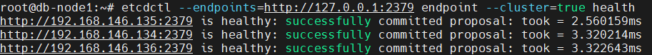
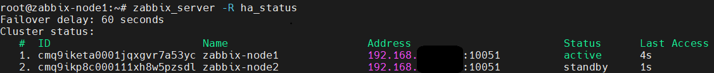

# Production Zabbix HA Stack


Production-grade highly available monitoring infrastructure using PostgreSQL 16, Patroni, etcd, Keepalived, HAProxy and Zabbix 7.0.

---

# Table of Contents

* [Overview](#overview)
* [Features](#features)
* [Architecture](#architecture)
* [Topology](#topology)
* [Technology Stack](#technology-stack)
* [Deployment Order](#deployment-order)
* [Deployment Workflow](#deployment-workflow)
* [Documentation](#documentation)
* [Repository Structure](#repository-structure)
* [Example Configuration Files](#example-configuration-files)
* [High Availability Workflow](#high-availability-workflow)
* [Tested Failover Scenarios](#tested-failover-scenarios)
* [Security Considerations](#security-considerations)
* [Lessons Learned](#lessons-learned)
* [Future Improvements](#future-improvements)
* [Screenshots](#screenshoot)
* [Disclaimer](#disclaimer)
* [Author](#author)

---

# Overview

This project demonstrates a complete high availability architecture for Zabbix monitoring infrastructure with automatic PostgreSQL failover, frontend redundancy and distributed cluster management.

The environment was built and tested on Ubuntu 24.04 servers.

The repository contains:

* Deployment documentation
* Example production-style configuration files
* Architecture diagrams
* Failover testing procedures
* Troubleshooting notes
* Operational lessons learned

---

# Features

* PostgreSQL High Availability
* Patroni automatic failover
* etcd distributed consensus
* Keepalived Virtual IP failover
* Zabbix HA nodes
* HAProxy frontend load balancing
* Production-style architecture
* Multi-node redundancy
* No single point of failure

---

# Architecture


---

# Topology

| Component             | Count |
| --------------------- | ----- |
| PostgreSQL Nodes      | 3     |
| Zabbix Nodes          | 2     |
| Virtual IP            | 1     |
| HAProxy Load Balancer | 1     |

---

# Technology Stack

| Technology    | Purpose                  |
| ------------- | ------------------------ |
| PostgreSQL 16 | Database                 |
| Patroni       | PostgreSQL HA management |
| etcd          | Distributed consensus    |
| Keepalived    | Virtual IP failover      |
| Zabbix 7.0    | Monitoring platform      |
| HAProxy       | Frontend load balancing  |
| Ubuntu 24.04  | Operating system         |

---

# Deployment Order

The environment should be deployed in the following order:

1. Prepare Ubuntu 24.04 servers
2. Configure network connectivity and hostname resolution
3. Install and configure ETCD cluster
4. Install PostgreSQL 16 on database nodes
5. Configure Patroni cluster management
6. Configure PostgreSQL replication and failover
7. Configure Keepalived Virtual IP
8. Validate PostgreSQL high availability
9. Install Zabbix server nodes
10. Configure Zabbix HA
11. Configure HAProxy frontend load balancing
12. Perform failover testing and validation

---

# Deployment Workflow

```text
Ubuntu Preparation
        ↓
ETCD Cluster
        ↓
PostgreSQL Installation
        ↓
Patroni Configuration
        ↓
Keepalived VIP
        ↓
Zabbix HA Nodes
        ↓
HAProxy Load Balancer
        ↓
Failover Validation
```

---

# Documentation

| Section                    | Description                                |
| -------------------------- | ------------------------------------------ |
| prerequisites.md           | Infrastructure and deployment requirements |
| etcd-installation.md       | Distributed consensus configuration        |
| postgresql-installation.md | PostgreSQL setup and replication           |
| patroni-installation.md    | PostgreSQL cluster management              |
| keepalived.md              | VIP failover                               |
| zabbix-ha.md               | Zabbix HA configuration                    |
| haproxy.md                 | Frontend load balancing                    |
| failover-testing.md        | HA scenario validation                     |
| troubleshooting.md         | Common issues and fixes                    |
| lessons-learned.md         | Operational observations                   |

---

# Repository Structure

```text
production-zabbix-ha-stack/
│
├── configs/        Example configuration files
├── diagrams/       Architecture diagrams
├── docs/           Deployment documentation
├── images/         Screenshots and validation images
├── scripts/        Helper scripts
└── README.md
```

---

# Example Configuration Files

The repository includes sanitized example configuration files for:

* ETCD
* PostgreSQL
* Patroni
* Keepalived
* HAProxy
* Zabbix HA

All sensitive information has been removed or replaced with placeholders.

---

# High Availability Workflow

1. Patroni manages PostgreSQL cluster leadership
2. etcd stores distributed cluster state
3. Keepalived moves the VIP between database nodes
4. Zabbix HA switches active server automatically
5. HAProxy distributes frontend traffic

---

# Tested Failover Scenarios

* PostgreSQL primary node failure
* Patroni leader re-election
* Keepalived VIP migration
* Zabbix HA failover
* Frontend redundancy validation

---

# Security Considerations

* SCRAM-SHA-256 authentication is recommended over MD5
* PostgreSQL access should be restricted to trusted networks
* PostgreSQL should not be exposed publicly
* Firewall rules should limit database access
* Strong passwords should be used for replication users

---

# Lessons Learned

* Proper PostgreSQL replication configuration is critical
* VIP migration timing impacts reconnect behavior
* Patroni and etcd provide reliable HA orchestration
* HA testing is essential before production deployment
* Operational visibility improves troubleshooting

---

# Future Improvements

* Docker deployment
* Kubernetes support
* Ansible automation
* Prometheus/Grafana integration
* TLS encryption between nodes
* Automated failover testing

---

# Screenshots

## ETCD Cluster Health




## Patroni Cluster Status


---

## PostgreSQL Replication


---

## Zabbix HA Status



---

## VIP Migration


---


# Disclaimer

This project is intended for educational and production-lab environments.

Review all security settings before using in production.

---

# Author

Soroush Mehmandoust
